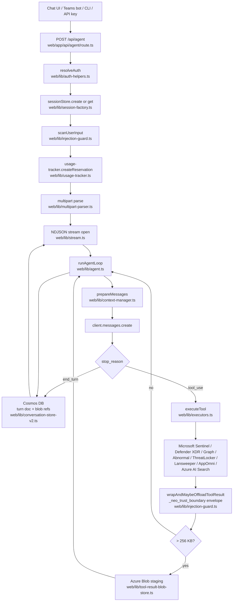
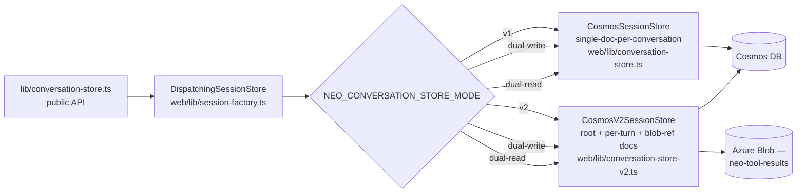

# Architecture

This document captures the request flow, persistence model, multi-instance shared-state primitives, and observability pipeline for Neo's web application. The CLI (`cli/`) is now a thin REST client of the web API (`cli/src/server-client.js`); it has no agent loop or tool dispatch of its own.

## Request flow

### Notable invariants

- **Authentication is centralised.** Every state-changing API route resolves identity through `resolveAuth` (`web/lib/auth-helpers.ts:76`). The exempt routes are `health`, `auth/discover`, `auth/[...nextauth]` (Auth.js itself), and `teams/messages` (Bot Framework JWT). `cli/version` and `downloads/[filename]` are intentionally pre-auth but IP-allowlisted by `web/proxy.ts`.
- **The destructive-tool confirmation gate** (`web/lib/agent.ts:435-506`) returns `confirmation_required` and pauses the loop. `resumeAfterConfirmation` (`web/lib/agent.ts:783`) re-runs the loop with the user's decision. Defense-in-depth: `executeTool` re-checks `canUseTool(role, toolName)` and throws `ToolPermissionError` if a future regression bypasses the visibility filter.
- **Trust boundary on tool results.** `wrapAndMaybeOffloadToolResult` wraps every tool result in a `_neo_trust_boundary` envelope before it returns to the model — bidirectional injection scanning lives here.
- **Plan resumption.** When the per-turn output budget interrupts a multi-step batch, `emit_plan` persists the remaining steps; the next turn's first iteration sees a system-prompt addendum that tells the model to resume from the unexecuted steps. The plan text is injection-scanned before promotion (`web/lib/agent.ts:626-643`, `web/lib/executors.ts:3791-3813`).

## Persistence

Neo carries two concurrent conversation-store schemas behind a single dispatcher.

- **v1 — `web/lib/conversation-store.ts`.** Single document per conversation. Partition key `/ownerId`.
- **v2 — `web/lib/conversation-store-v2.ts`.** Root + per-turn + blob-ref docs. Partition key `/conversationId`. Tool results > 256 KB offload to Azure Blob; the staging→commit promote runs only after the Cosmos batch commits (see `web/lib/tool-result-blob-store.ts`).
- **Dispatcher — `web/lib/session-factory.ts`.** Selects the store per request from `NEO_CONVERSATION_STORE_MODE` (env-var; admins can override per-request via the `X-Neo-Store-Mode` header). `dual-read` reads v2, falls back to v1; `dual-write` writes both, reads v1.
- **Retention classes** (`web/lib/retention.ts`): `standard-7y`, `legal-hold`, `client-matter`, `transient`. `legal-hold` sets Cosmos `ttl: -1` to suspend automatic deletion AND blocks manual deletion at both the route and the store (returns HTTP 423 Locked from `DELETE /api/conversations/[id]`).

## Multi-instance shared state

Neo runs on Azure App Service with horizontal scale-out. All formerly-in-memory state lives in Cosmos behind atomic primitives:

- **Per-user usage tracking** — pessimistic reservations in their own Cosmos container (`web/lib/usage-tracker.ts:83`). Reservations are deleted in the route's `finally`; orphans expire via Cosmos TTL.
- **Triage circuit breaker** — Cosmos-backed atomic Patch/IfMatch operations in `web/lib/instance-shared-counter.ts`, consumed by `web/lib/triage-circuit-breaker.ts`. Auto-cooldown.
- **Triage rate limiter** — same shared-counter primitive, per-caller.
- **Skill store** — Cosmos container, 15-second read-through cache (`web/lib/skill-store.ts`).
- **API key store** — Cosmos-only in production. The mock-mode file fallback is hard-disabled when `NODE_ENV=production` (`web/lib/config.ts validateConfig`).

## Observability

- **`web/lib/logger.ts`** — singleton `logger` with `AsyncLocalStorage`-scoped identity context (`setLogContext`/`getLogContext`).
- **Metadata allowlist** — `SAFE_METADATA_FIELDS` strips any field not on the list before emission. Identifiers that are PII (UPNs, owner IDs) must be hashed via `hashPii()` first.
- **Dual buffered Event Hub sinks** — `eventType` routes either to the operational topic or the analytics topic (or both). Console mirror always for warn/error.
- **PII hashing** — `hashPii(value)` returns the first 16 hex chars of SHA-256. Used for `ownerIdHash`, `aadObjectIdHash`, and `metadata.user_id` to Anthropic.

## Configuration

- **12-factor** — every runtime knob is an env var; see `web/lib/config.ts` and `.env.example`.
- **Validation** — `validateConfig()` runs on every health probe. Fails fast on:
  - Missing `ANTHROPIC_API_KEY`
  - `NODE_ENV=production` without `COSMOS_ENDPOINT`
  - `DEV_AUTH_BYPASS=true` outside development
  - `MOCK_MODE=true` in production
- **Models** — `claude-sonnet-4-6` default, `claude-opus-4-6` opt-in, `claude-haiku-4-5-20251001` for context-window compression.

## Adding a new tool

The canonical instructions live in `CLAUDE.md`. The short version: edit `web/lib/tools.ts` (schema), `web/lib/executors.ts` (executor + mock + registry entry), `web/lib/types.ts` (input/output types). For destructive tools, also add to `DESTRUCTIVE_TOOLS` in `web/lib/tools.ts`. Add tests under `web/test/`.
